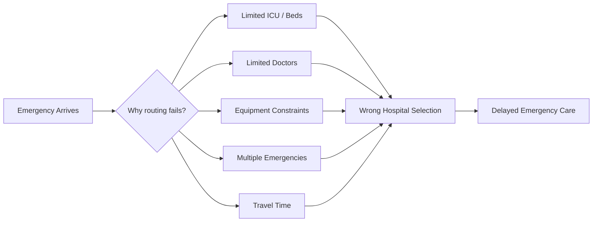
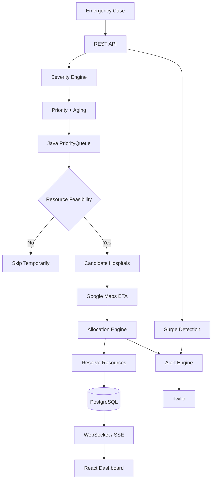
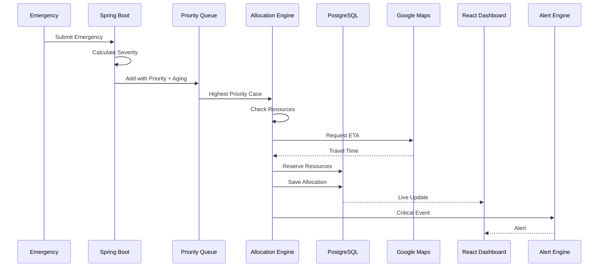
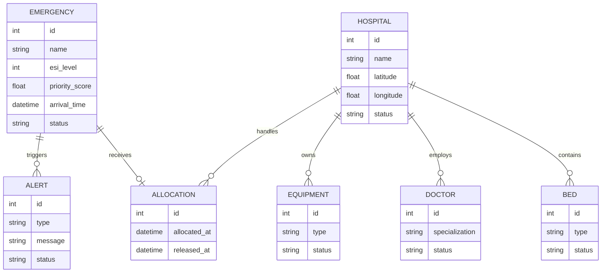

prototype website link  https://emergenry-router.vercel.app/
# 🚑 Smart Emergency Response & Hospital Capacity Router

> **Real-time emergency routing based on severity, hospital capacity, resource availability and travel time.**

When an emergency case arrives, the system doesn't simply send it to the **nearest hospital**.

It asks:

**"Which hospital can actually handle this patient right now?"**

The system evaluates severity, waiting time, ICU/bed/equipment availability, doctor specialization and travel ETA — then assigns the best feasible hospital.

---

## 🧠 The Problem

During emergency situations, hospitals may have:

* ❌ No available ICU beds
* ❌ Required equipment already occupied
* ❌ No suitable specialist available
* ❌ Long travel time
* ❌ Multiple emergencies competing for limited resources

So **nearest ≠ best**.

### Root Cause



---

# ⚡ Our Solution

We built a **real-time constrained resource allocation system** that:

1. Receives an emergency case through REST API
2. Assigns an **ESI-inspired severity level**
3. Calculates an aging-based priority score
4. Places the case into a `PriorityQueue`
5. Finds hospitals capable of handling its resource requirements
6. Calculates travel ETA
7. Selects the best feasible hospital
8. Reserves resources transactionally
9. Updates the live dashboard
10. Detects emergency surges
11. Sends alerts for critical events

---

# 🔥 Core Architecture



---

# 🧩 The Interesting Part — Priority + Aging

A simple priority system can create **starvation**.

Imagine:

```text
Patient A → Severity 2
Patient B → Severity 4
Patient C → Severity 4
Patient D → Severity 4
...
```

If high-severity cases keep arriving, lower-priority patients could theoretically wait forever.

So we introduce **aging**.

### Priority Formula

```text
Priority Score =
    (Severity Weight × Severity Score)
    +
    (Aging Weight × Waiting Time)
```

Example:

```text
severityWeight = 10
agingWeight    = 0.5
```

These are **simulation parameters**, not medical standards.

Every few seconds, waiting priorities are recalculated and the heap is rebuilt.

---

# 🏥 Resource-Aware Routing

The system does **not** select the nearest hospital first.

Example:

```text
Hospital A → 3 km → ❌ No ICU
Hospital B → 7 km → ✅ ICU + Ventilator
Hospital C → 5 km → ❌ Required specialist unavailable
```

Result:

```text
                Required Resources
                       │
                       ▼
        ┌──────────────────────────┐
        │ Find Feasible Hospitals  │
        └────────────┬─────────────┘
                     │
          ┌──────────┼──────────┐
          ▼          ▼          ▼
       Hospital A  Hospital B  Hospital C
          ❌          ✅          ❌
                     │
                     ▼
                Calculate ETA
                     │
                     ▼
               Assign Hospital B
```

**Feasibility comes before distance.**

---

# 🚨 Severity Simulation

The project uses an **ESI-inspired deterministic simulation**.

| Level | Meaning     | Example                                  |
| ----- | ----------- | ---------------------------------------- |
| 1     | Immediate   | Cardiac arrest / extreme instability     |
| 2     | Emergent    | Severe breathing difficulty / chest pain |
| 3     | Urgent      | Fracture / significant abdominal pain    |
| 4     | Less urgent | Minor laceration                         |
| 5     | Non-urgent  | Cold / minor rash                        |

> ⚠️ This is a hackathon simulation and **not a clinical decision-making system**.

---

# 🔄 Complete System Flow



---

# 📊 Surge Detection

The system also monitors emergency arrival rates.

```text
Current 15-min arrivals
          │
          ▼
Compare with historical baseline
          │
          ▼
current > baseline + 2 × standard deviation
          │
          ▼
       🚨 SURGE
```

When a surge is detected:

* Alert is created
* Alert is stored
* Dashboard is updated
* Twilio notification can be triggered

---

# 🛠️ Tech Stack

### Backend

* Java
* Spring Boot
* REST APIs
* Java `PriorityQueue`
* WebSocket / Server-Sent Events

### Database

* PostgreSQL

### Frontend

* React
* Real-time dashboard
* Charts & analytics

### External Services

* Google Maps API — travel distance / ETA
* Twilio — emergency notifications

### Algorithms

* Priority Queue / Max Heap
* Aging-based scheduling
* Resource constraint matching
* Moving average / Z-score based surge detection

---

# 📡 API Overview

```http
POST   /api/emergencies
GET    /api/emergencies
GET    /api/emergencies/{id}

GET    /api/hospitals
GET    /api/hospitals/{id}
PUT    /api/hospitals/{id}/capacity

POST   /api/allocate/{emergencyId}
GET    /api/allocations/{id}

GET    /api/dashboard/summary
GET    /api/alerts
```

### Example

```json
{
  "name": "Patient 101",
  "age": 54,
  "symptoms": [
    "chest pain",
    "breathing difficulty"
  ],
  "vitals": {
    "heartRate": 125,
    "spo2": 86,
    "systolicBP": 90
  },
  "requiredResources": [
    "ICU",
    "VENTILATOR"
  ]
}
```

Response:

```json
{
  "emergencyId": "E101",
  "severityLevel": 2,
  "priorityScore": 24.5,
  "hospitalId": "H03",
  "etaMinutes": 9,
  "resourcesReserved": [
    "ICU-04",
    "VENT-02"
  ],
  "status": "ASSIGNED"
}
```

---

# 🗄️ Data Model



---

# 🎯 What Makes This Different?

### ❌ Traditional approach

```text
Emergency
    ↓
Nearest Hospital
    ↓
Hope it has resources
```

### ✅ Our approach

```text
Emergency
    ↓
Severity
    ↓
Priority + Aging
    ↓
Resource Feasibility
    ↓
Travel ETA
    ↓
Best Feasible Hospital
    ↓
Reserve Resources
    ↓
Live Update + Alerts
```

The key idea:

> **Don't route based on distance alone. Route based on feasibility + urgency + real-time availability.**

---

# 🧪 Demo Scenario

Our final demo demonstrates:

* 🚨 Critical ICU + ventilator emergency
* 🏥 Multiple hospitals with different resources
* 🧠 Severity calculation
* ⚡ Priority queue scheduling
* ⏳ Aging / starvation prevention
* 📍 Travel ETA
* 🔒 Resource reservation
* 📊 Live dashboard updates
* 🚑 Patient discharge and resource release
* 📈 Emergency surge simulation
* 📱 Alert history / Twilio notification

---

# 👥 Team

| Member        | Responsibility                                                        |
| ------------- | --------------------------------------------------------------------- |
| **Team Lead** | Backend, allocation engine, severity, PriorityQueue, Maps integration |
| **Trishti**   | React dashboard, real-time UI, charts, visualizations                 |
| **Member 3**  | Anomaly detection, surge detection, Twilio alerts                     |

---

# ⚠️ Important Scope

This project uses:

* Simulated patients
* Simulated hospital resources
* ESI-inspired deterministic severity rules
* Simulated emergency scenarios

It is a **hackathon prototype**, not a production clinical triage or hospital management system.

---

# 🚀 Build Philosophy

```text
Allocation Engine
       ↓
External APIs
       ↓
Real-Time Dashboard
       ↓
Alerts & Analytics
       ↓
Polish + Deployment
```

**Build the decision engine first. Make it visual second. Make it pretty last.**

---

## 🏆 One-Line Pitch

> **A real-time emergency routing engine that matches patients to the best feasible hospital using urgency, resource availability, aging-based scheduling and travel time — while continuously monitoring the system for critical events and emergency surges.**
